## NICopyDBToSandBox

---
NICopyDBToSandBox (0.0.2)
   NICopyDBToSandBox:拷贝DB文件到沙盒里及其他牵涉沙盒Documents文件夹内/产品（Ant.ipa包里面）文件夹内fileName操作
   - pod 'NICopyDBToSandBox', '~> 0.0.2'
   - Homepage: https://nixinsheng.github.io/
   - Source:   https://github.com/wvqusrtg/NICopyDBToSandBox.git
   - Versions: 0.0.2 [master repo]

>/**

> 拷贝DB模板用，不单单可以拷贝 AS.sqlite库文件，还有其他资源文件也可以通用这个方法  DATA_BASE_FILE_NAME

> 

> @param DBName 数据库名称

> @return 是否拷贝成功
> */

>+(BOOL)copyDBToDocumentsWithDBName:(NSString *)DBName;

>

>/**

> 获取Documents路径

> 

> @return Documents路径

> */

>+(NSString *)getDocumentsPath;

>

>/**

> 获取Documents路径下所有文件

> 

> @return 获取到的Documents路径下所有文件NSArray列表

> */

>+(NSArray*)getAllFileNamesArrayFromDocuments;

>

>/**

> 获得文件在沙盒documents文件下详细路径，名字方便记忆

> 

> @param filename 文件名称要已知

> @return 文件在沙盒documents文件下详细路径

> */

>+(NSString *)getFileFullPathFromDocuments:(NSString *)filename;

>

>/**

> 获取文件在工程中（产品）（Ant.ipa包里面）的详细路径

> 

> @param filename 文件名称

> @return 文件在工程中（Ant.ipa包里面）的详细路径

> */

>+(NSString *)getFileFullPathFromProduct:(NSString*)filename;

>

>/**

> 把NSDictionary/NSMutableArray写入到沙盒Documents文件夹内fileName(eg:UserInfo.plist文件不存在则新建文件)里

>

> @param dic 目标待写入字典

> @param fileName 目标写入文件名

> @return 是否写入成功

> */
>+(BOOL)saveNSDictionaryForDocuments:(NSDictionary *)dic WithFileName:(NSString*)fileName;

>+(BOOL)saveNSMutableArrayForDocuments:(NSMutableArray *)dic WithFileName:(NSString*)fileName;

>

>/**

> 把NSDictionary/NSMutableArray写入到产品（Ant.ipa包里面）文件夹内fileName(eg:UserInfo.plist文件不存在则新建文件)里
> 

> @param dic 目标待写入字典

> @param fileName 目标写入文件名

> @return 是否写入成功

> */

>+(BOOL)saveNSDictionaryForProduct:(NSDictionary *)dic WithFileName:(NSString*)fileName;

>+(BOOL)saveNSMutableArrayForProduct:(NSMutableArray *)dic WithFileName:(NSString*)fileName;

>

>/**

> 加载沙盒Documents文件夹内/产品（Ant.ipa包里面）文件夹内fileName里plist数据NSDictionary/NSMutableArray

>

> @param fileName 文件名

> @return 加载来数据

> */

>+(NSDictionary *)loadNSDictionaryFromDocumentsWithFileName:(NSString*)fileName;

>+(NSDictionary *)loadNSDictionaryFromProductWithFileName:(NSString*)fileName;

>+(NSArray *)loadNSArrayFromDocumentsWithFileName:(NSString*)fileName;

>+(NSArray *)loadNSArrayFromProductWithFileName:(NSString*)fileName;

>

>//判断沙盒Documents文件夹内/产品（Ant.ipa包里面）文件夹内 文件是否存在

>+(BOOL) fileIsExistsFromDocumentsWithFileName:(NSString*)fileName;

>+(BOOL) fileIsExistsFromProductWithFileName:(NSString*)fileName;

>
---

>1、效果Flowing
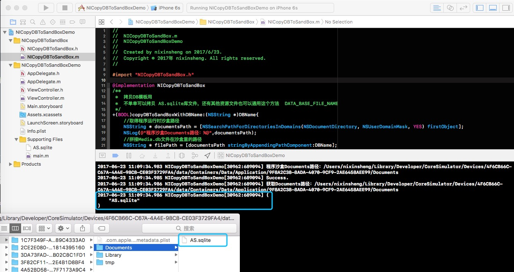

>2、NICopyDBToSandBox (0.0.1)
   NICopyDBToSandBox:拷贝DB文件到沙盒里的Document目录下
   - pod 'NICopyDBToSandBox', '~> 0.0.1'
   - Homepage: https://nixinsheng.github.io/
   - Source:   https://github.com/wvqusrtg/NICopyDBToSandBox.git
   - Versions: 0.0.1 [master repo]

>3、[iOS 沙盒目录结构及正确使用](http://www.jianshu.com/p/dd3f120eb249)

>#####沙盒目录结构-每个APP的沙盒下面都有相似目录结构，如图（苹果官方文档）

>

>

>4、二、获取各种文件目录的路径

>获取目录路径的方法：

>// 获取沙盒主目录路径
>NSString *homeDir = NSHomeDirectory();

>// 获取Documents目录路径

>NSString *docDir = [NSSearchPathForDirectoriesInDomains(NSDocumentDirectory, NSUserDomainMask, YES) firstObject];

>// 获取Library的目录路径

>NSString *libDir = [NSSearchPathForDirectoriesInDomains(NSLibraryDirectory, NSUserDomainMask, YES) lastObject];

>// 获取Caches目录路径

>NSString *cachesDir = [NSSearchPathForDirectoriesInDomains(NSCachesDirectory, NSUserDomainMask, YES) firstObject];

>// 获取tmp目录路径

>NSString *tmpDir =  NSTemporaryDirectory();

>获取应用程序程序包中资源文件路径的方法：

>NSLog(@"%@",[[NSBundle mainBundle] bundlePath]);

>NSString *imagePath = [[NSBundle mainBundle] pathForResource:@"apple" ofType:@"png"];

>UIImage *appleImage = [[UIImage alloc] initWithContentsOfFile:imagePath];
---

##自己封装开源库上传到cocoapods

>step1:github上开仓库
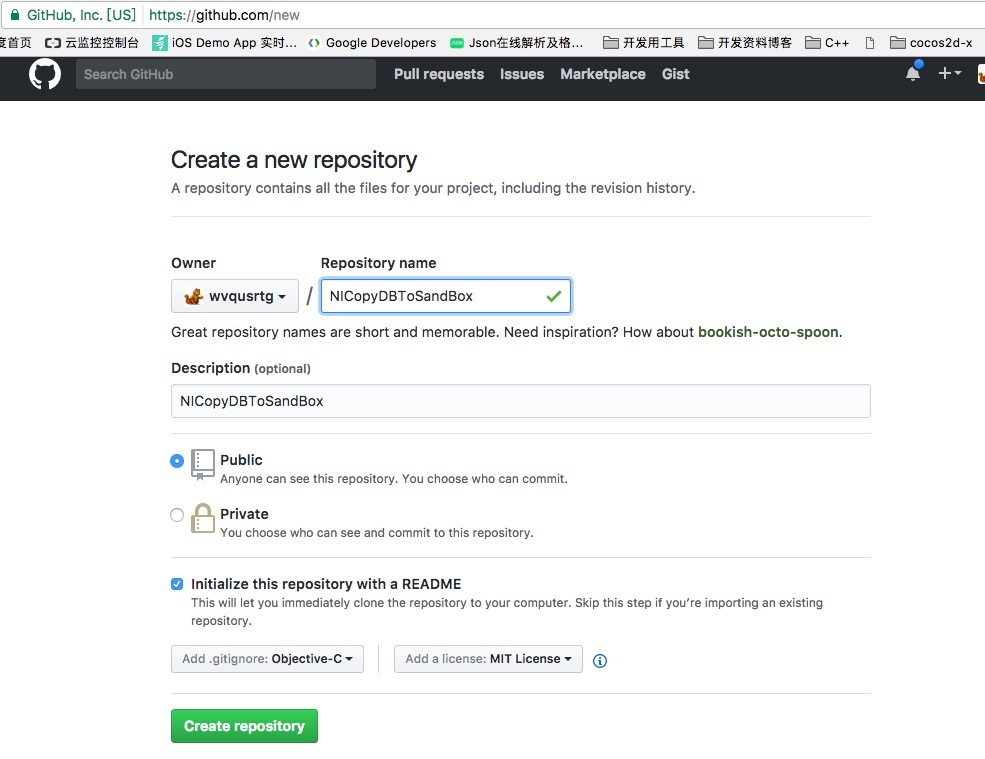

>step2:本地开工程执行操作如下：
>>1st:git init
>>2st:git remote add origin https://github.com/wvqusrtg/NICopyDBToSandBox.git
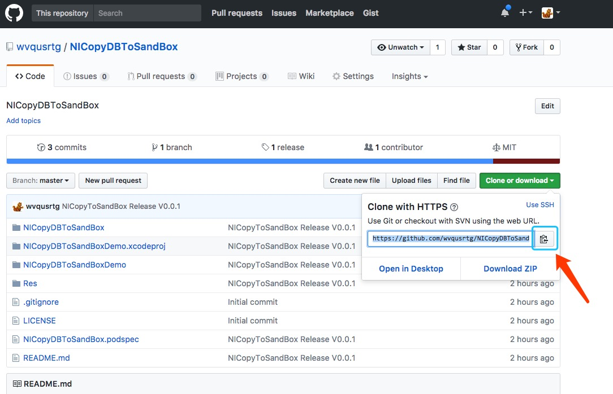
>>3st:git pull origin master

>step3:[使开源库支持pod](http://tech.yunyingxbs.com/article/detail/id/272.html)
>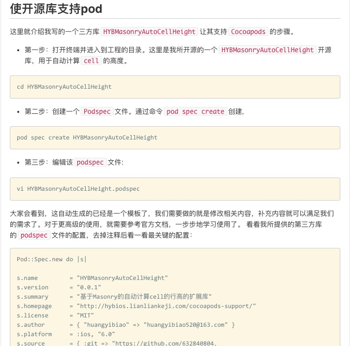

>step4:[NICopyDBToSandBox.podspec](NICopyDBToSandBox.podspec)
>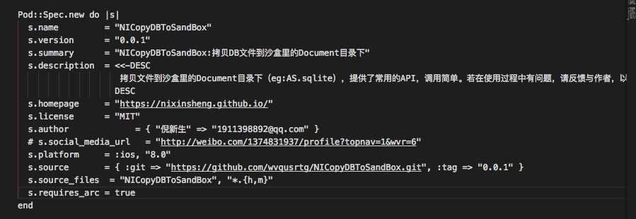

>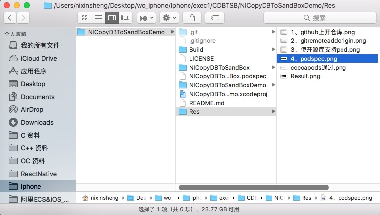

>step5:这里呢，我们设置的版本号为0.0.1，那么tag号为0.0.1，因此我们还需要新建一个tag,名为0.0.1，然后推到git：

>$ git commit -m "如果当前有变化，先提交到git上，再创建tag"

>$ git tag 0.0.1

>$ git push --tags

>$ git push origin master

>step6: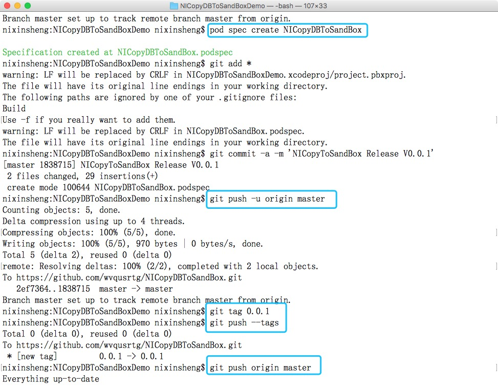

>step7: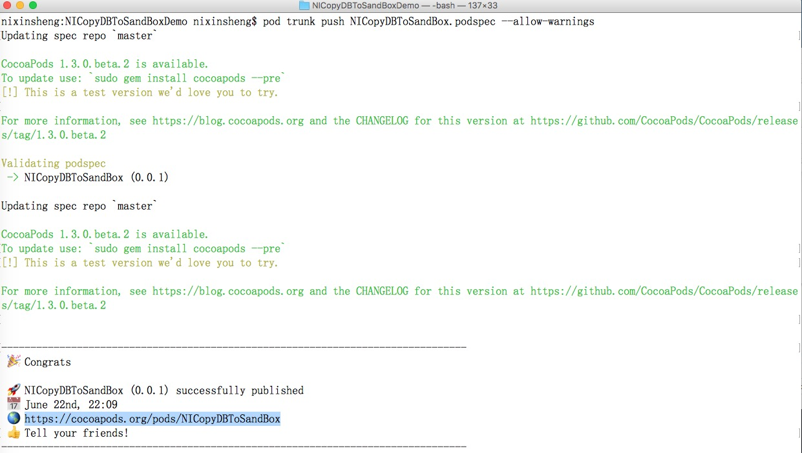

>step8: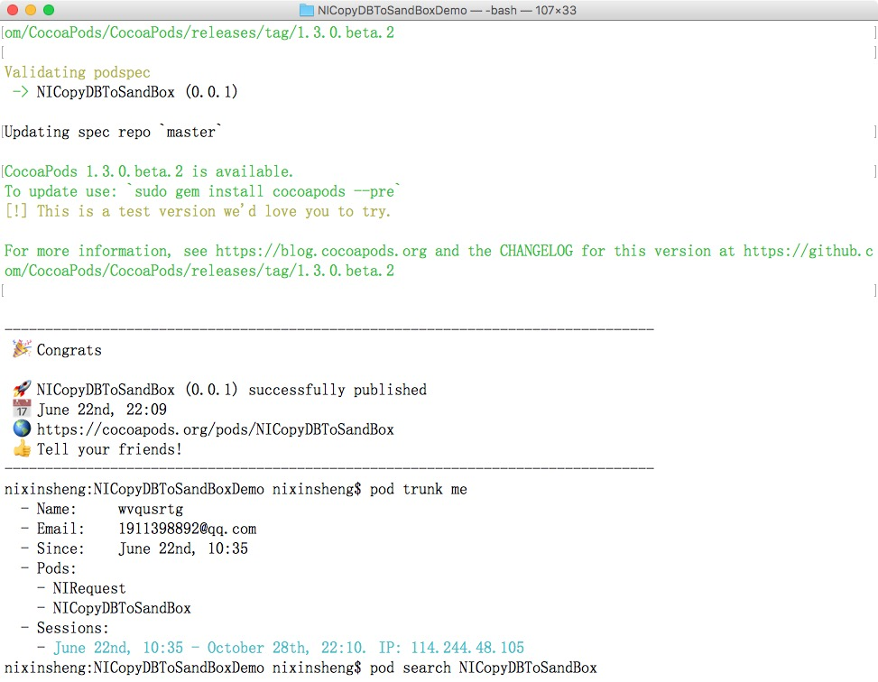

>step9: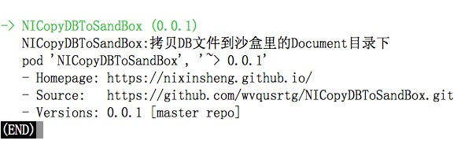

>step10: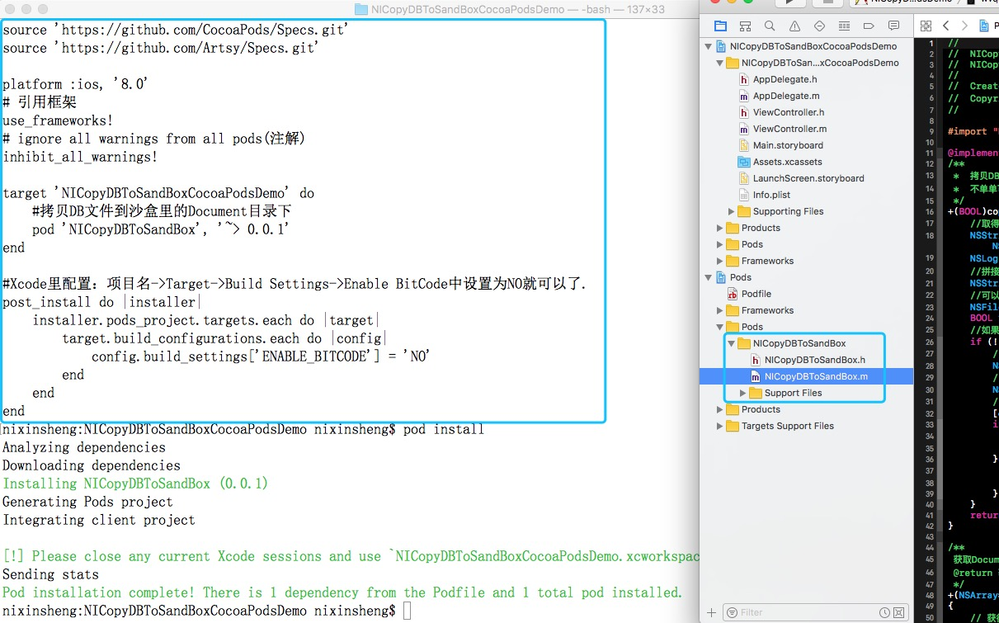